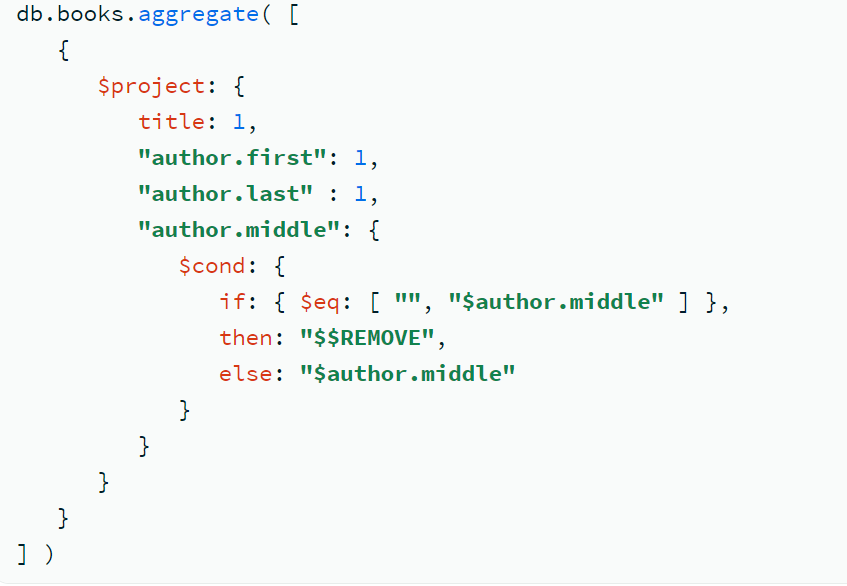
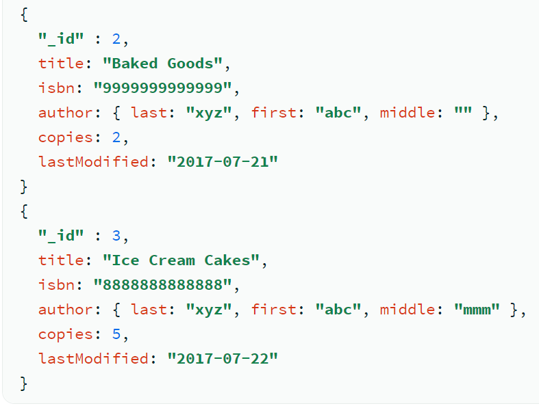

## Aggregation Pipeline 
Ref : https://docs.google.com/document/d/1RnxuGi6Zp67wpiXVTW5VR6sKFjovWqi1pNyLZOnQvlg/edit?usp=sharing

**{08/07/2024}**
##### Data Count 
- data can be counted either by using the **$sum** within in the pipeline or by using **$count** : "string" outside the pipeline or using the same pipeline

**$project**
- Passes along the documents with the requested fields to the next stage in the pipeline. The specified fields can be existing fields from the input documents or newly computed fields
- The $project takes a document that can specify the inclusion of fields, the suppression of the _id field (means replacing the existing field with some other key ), the addition of new fields, and resetting of the values of existing fields.

- Ref below the **$cond** working




- Ref for inclusion and exclusion operations of $project stage: https://www.mongodb.com/docs/manual/reference/operator/aggregation/project/#std-label-remove-example

- **$unset*** 
can also be used exclude fields.
it can exlude the single field or nested field from array using(country.England)
Ref : https://www.mongodb.com/docs/manual/reference/operator/aggregation/unset/#mongodb-pipeline-pipe.-unset

**$push**
can be used to add a single field , complete array , field inside the sisting array
ref:https://www.mongodb.com/docs/manual/reference/operator/update/push/


**Bucket**
- Categorizes incoming documents into groups, called buckets, based on a specified expression and bucket boundaries and outputs a document per each bucket. Each output document contains an _id field whose value specifies the inclusive lower bound of the bucket.

- $bucket only produces output documents for buckets that contain at least one input document.

- The $bucket stage has a limit of 100 megabytes of RAM
Ref for Agg pipeline limit: https://www.mongodb.com/docs/manual/core/aggregation-pipeline-limits/

``` we can't use $sum without $group ```


**$set**
- appends new fields to existing documents. You can include one or more $set stages in an aggregation operation.

- *$set* accepts the embedding of objects where you can set a value to an aggregation expression or to an empty object. For example, the following nested objects are accepted:
    
 ```
 db.animals.aggregate( [
  { $set: { cats: 20 } }
] )
---------------------------------
 db.scores.aggregate( [
   {
     $set: {
        totalHomework: { $sum: "$homework" },
        totalQuiz: { $sum: "$quiz" }
     }
   },
   {
     $set: {
        totalScore: { $add: [ "$totalHomework", "$totalQuiz", "$extraCredit" ] } }
   }
] )
 ```

**$facet** 
- It represent the outout of prev stage with the new aspect according to the different facent condition
- It apply additional filters and categorize to produce the output 
- 